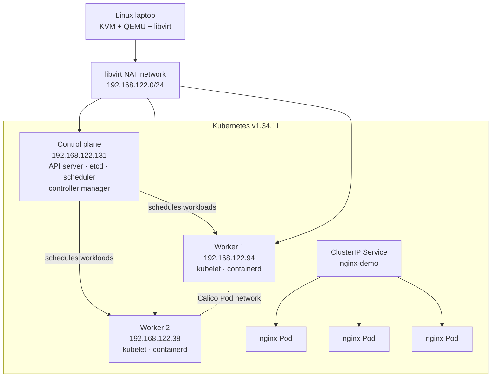

# Architecture

This lab runs a practical, non-HA Kubernetes cluster inside three Ubuntu virtual machines on one Linux laptop.



```text
Linux host
└── libvirt default NAT network (192.168.122.0/24)
    ├── k8s-control-plane  192.168.122.131
    │   ├── kube-apiserver / scheduler / controller-manager / etcd
    │   ├── kubelet
    │   └── containerd
    ├── k8s-worker-1       192.168.122.94
    │   ├── kubelet
    │   └── containerd
    └── k8s-worker-2       192.168.122.38
        ├── kubelet
        └── containerd

Pod network: 10.244.0.0/16 (Calico v3.32.1)
Service routing: kube-proxy
```

The control-plane API is advertised at `192.168.122.131:6443`. The Pod network is separate from the VM network. Calico assigns Pod addresses from `10.244.0.0/16` and provides connectivity between Pods on different nodes.

This is a learning cluster with one control plane, so the Kubernetes API is unavailable if that VM is stopped. A production design would normally use multiple control-plane nodes, durable storage, backups, and a load-balanced API endpoint.
